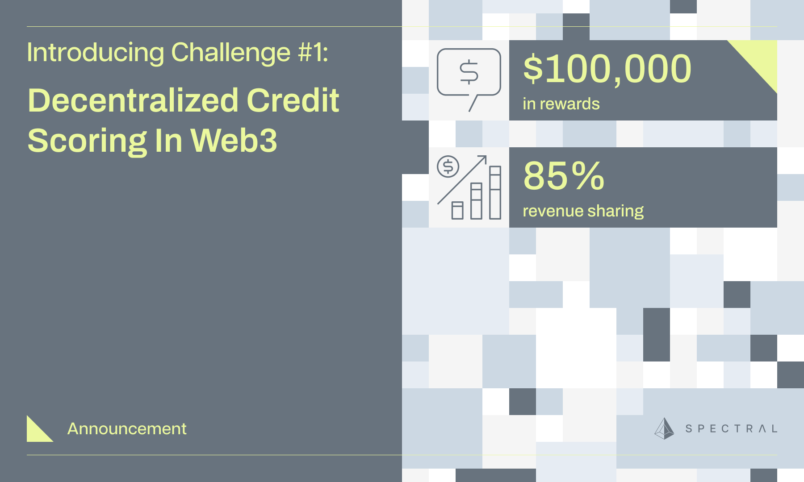

# Challenge 1 Modeler Starter Kit
**Technical Introduction to the 2023 Decentralized Credit Scoring in Web3 Challenge and Spectral Platform**

**[Gitbook](https://docs.spectral.finance/)**
| **[Website](https://app.spectral.finance/challenges/QmXwAbCDeFgH1234567890)**
| **[Discord](https://discord.gg/w7mKT2KBKh)**
| **[Slack](https://join.slack.com/t/spectralcommunity/shared_invite/zt-270pp4l2p-gR8KfjQ9hQEv11h_tyCuTQ)**
| **[Twitter](https://twitter.com/SpectralFi)**
| **[Announcement](https://blog.spectral.finance/challenge-1-credit-scoring-web3/)**




## What is Challenge 1?

While traditional finance relies on credit scores to gauge the risk of default, decentralized finance (DeFi) has been largely dependent on over-collateralization (i.e. the equivalent of a secured credit card). An effective on-chain credit score would improve capital efficiency and create a more inclusive, efficient DeFi ecosystem that could one day surpass traditional financial institutions.

Your goal is to predict liquidation (as per binary classification) of an active borrower on Aave v2 Ethereum and Compound v2 Ethereum using PyTorch. Liquidation here includes both:

* Actual liquidation, when a borrower’s health factor drops below the liquidation threshold, triggering a liquidation event; AND
* Technical liquidation, when a borrower’s health factor drops below 1.2.

Technically speaking, and to ensure numerical stability, we take the reciprocal of the health factor (which we call the risk factor) and use it in the features.

See the [announcement page](https://blog.spectral.finance/challenge-1-credit-scoring-web3/) for more details on the importance of this problem and challenge design.

Our [Gitbook](https://docs.spectral.finance/) contains the most comprehensive information on the tooling required to participate in this challenge,
along with an overview of the technical architecture of the Spectral platform.

## Goals
This repo aims to help participants understand the following components of the challenge:
1. Using the Spectral CLI
2. The training dataset
3. The submission format
4. Leveraging zero knowledge machine learning (implicit in this Starter Kit)


## Status

**This version is for internal testing only and is not suitable for public release.** 

## For Developers


### Prepare Your Environment

#### We strongly recommend interacting with the Spectral CLI in an isolated virtual environment using Python 3.11.6.

To manage multiple versions of Python on a single machine we recommend [asdf](https://asdf-vm.com/).

##### First, clone the repository
```
git clone https://github.com/Spectral-Finance/challenge-1-modeler-starter-kit.git
cd challenge-1-modeler-starter-kit
```

#### If you followed Gitbook installation steps 1-4 previously skip to "Install the required packages"
It is not necessary to follow the gitbook installation process if you have not done so already. 

##### Create a new virtual env
```
python -m venv env
```

##### Activate the environment

On macOS and Linux
```
source env/bin/activate
```

On Windows (running [Git Bash for Windows](https://gitforwindows.org/))
```
source env/Scripts/activate
```


##### Install the required packages. 

These packages are required to analyze the dataset in this Starter Kit and to train an example model.  
```
pip install -r requirements.txt
```
macOS and Linux users ensure you have llvm and libomp installed to use PyTorch.

If not already installed, you may install them with homebrew/linuxbrew.
```
brew install llvm
brew install libomp
```


If using an application like PyCharm, be sure to set the Python interpreter to the virtual environment you just created.

[//]: # (### Spectral CLI setup)

[//]: # ()
[//]: # (To configure the Spectral CLI you'll first need to sign up for free accounts on [Spectral]&#40;https://www.app.dev.spectral.finance/profile&#41; and [Alchemy]&#40;https://www.alchemy.com/?ref=github.spectral.finance&#41;)

[//]: # ()
[//]: # (```)

[//]: # (spectral-cli configure)

[//]: # (```)

[//]: # (Follow the instructions in terminal to configure the Spectral CLI.)

[//]: # ()
[//]: # ()
[//]: # (You should see a message stating:)

[//]: # ()
[//]: # ("Config has been updated. You can fetch training data now.")


### Download Data, Start Modeling, and Prepare Submissions

After configuration, you are ready to begin exploring the dataset and training your model!

For a seamless experience, it is recommended to open this notebook in an IDE like PyCharm,
or run the jupyter notebook in a browser using the following command in terminal:
```
jupyter lab
```

[See this notebook for a walkthrough of the entire process](./modeler_starter_kit.ipynb)

This notebook will create example files required for submission, which you can use as a template for your own submission.

## Getting Help
If you have any questions, first see if the answer to your question can be found in the [Gitbook](https://docs.spectral.finance/).

Reach out to us on [Discord](https://discord.gg/w7mKT2KBKh) if you have any questions.

## Resources

For context on how Spectral approached Credit Scoring Models in Web3, check out these blog posts:
* [Introduction to the MACRO Score](https://blog.spectral.finance/introduction-to-macro-score)
* [A Deeper Look at the MACRO Score (Part 1)
](https://blog.spectral.finance/a-deeper-look-at-the-macro-score-part-one/)
* [A Deeper Look at the MACRO Score (Part 2)
](https://blog.spectral.finance/a-deeper-look-at-the-macro-score-part-2/)


## Acknowledgements
This work would not be possible without the contributions from the following teams:
* [Alchemy](https://www.alchemy.com/?ref=github.spectral.finance)
  * Powerful set of APIs, SDKs, and tools to build and scale your web3 app with ease.
* [Cryo](https://github.com/paradigmxyz/cryo?ref=github.spectral.finance)
  * Efficient EVM data extraction tools. 
* [DuckDB](https://duckdb.org/)
  * In-process SQL OLAP database management system.
* [Erigon](https://erigon.ch/?ref=github.spectral.finance)
  * Implementation of Ethereum (execution layer with embeddable consensus layer).
* [ezkl](https://github.com/zkonduit/ezkl?ref=github.spectral.finance)
  * An engine for doing inference for deep learning models and other computational graphs in a zk-snark.
* [The Graph](https://thegraph.com/?ref=github.spectral.finance)
  *  A decentralized protocol for indexing and querying blockchain data.
* [Messari Subgraphs](https://subgraphs.messari.io/?ref=github.spectral.finance) 
  * Core Subgraph Developer for The Graph.
* [Reth](https://github.com/paradigmxyz/reth?ref=github.spectral.finance) 
  * Modular, contributor-friendly, and blazing-fast implementation of the Ethereum protocol.
* [Transpose](https://www.transpose.io/?ref=github.spectral.finance) 
  * Indexed real-time blockchain data with powerful integration options. 